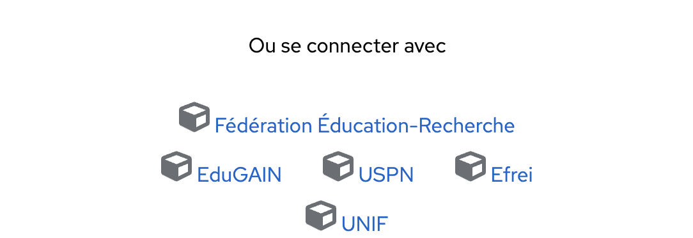
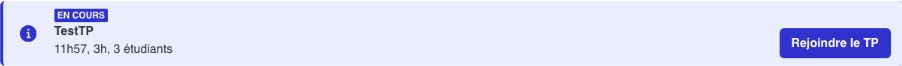
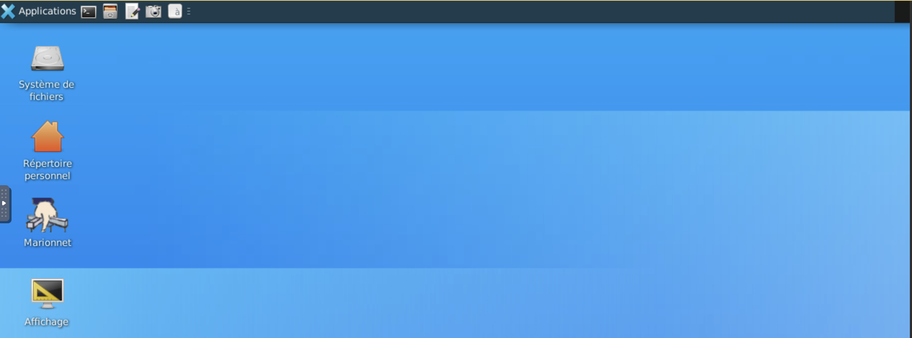

### What is MarioNum?

**MarioNum** is an interactive self-training platform for digital skills developed by the MESRI (French Ministry of Higher Education, Research and Innovation). It was designed as an educational cloud, incorporating at its core technological and pedagogical innovations, multi-dimensional inclusivity, and economic and digital sobriety.

MarioNum was built around the following objectives:
    
- **Expand the range of lab virtualization tools** to cover other areas of digital technology — connected objects, wireless networks, and cybersecurity are the first planned steps in this project.
- **Make these innovations accessible to as many learners and instructors as possible**, while meeting objectives of economic, digital, and environmental sobriety and inclusivity (geographically or temporally remote learners, or learners with disabilities). The project is therefore hosted in the cloud in the Ministry-certified Datacenter, a choice driven by the need for sobriety, resource pooling, and opening applications to the entire Higher Education ecosystem. The redesigned user interface (UX/UI) will also promote its accessibility and inclusivity for a wide audience.
- **Provide rich and innovative pedagogical content through varied learning capsules**, but also by providing real support for learning situations and self-assessment. On one hand, exploring AI techniques for recommending learning paths will help learners improve their results. On the other hand, enriching pedagogical content is planned in collaborative mode, and some national stakeholders have already expressed their interest.

!!! objectifs "Why MarioNum in this course?"
    The course objective is to **master the fundamentals of Linux through hands-on command-line practice**. MarioNum is an **excellent pedagogical gateway** toward this goal.

    MarioNum will allow us to:
    
    - Get introduced to the Linux environment in a guided manner.
    - Learn at your own pace with progressive modules.
    - Gain efficiency from the very first lab sessions.


### Getting started with MarioNum

!!! info "Note"
    Before each lab session, you will receive login credentials to access MarioNum.

1. Open a browser (Firefox, Chrome, Edge…).
2. Go to the MarioNum website via the link provided and scroll to the bottom of the page where you will see the image below. Click on **"Efrei"** 

3. Enter your myEFREI authentication credentials (Login + password)
4. Then click on "**Join the lab**".

5. You will see the page below. Click on connect and enter the password provided at the beginning of the lab.

6. The following interface will appear 

7. Click on "**Applications**" --> "**Terminal Emulator**" --> Then type the following commands 
```bash
   whoami
   hostname
   ls /
   uname -a
```

!!! info
    Don't worry, we will go over these commands in detail during the course!
