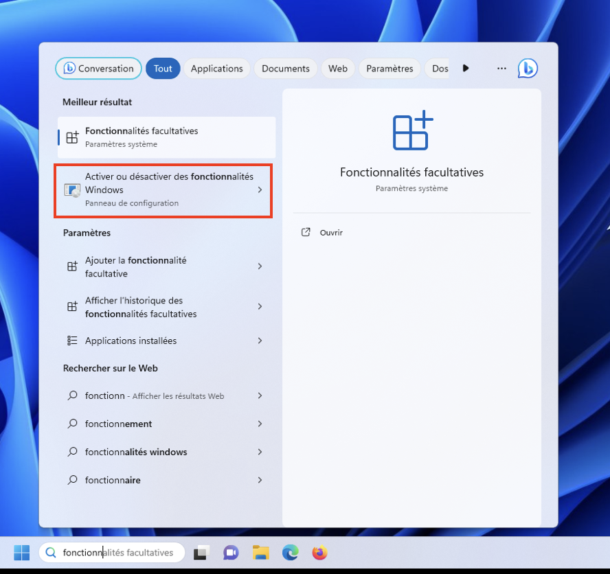
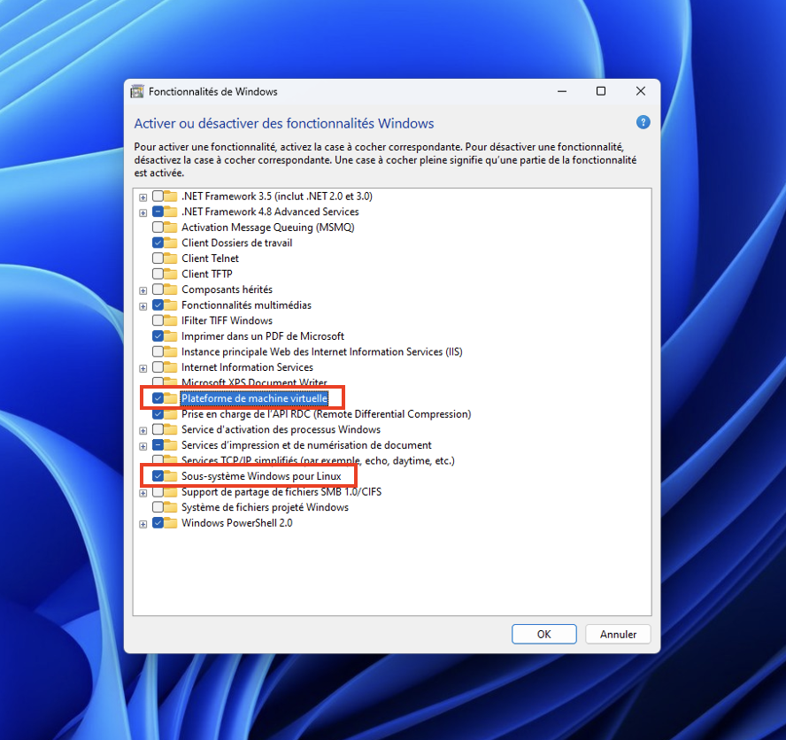
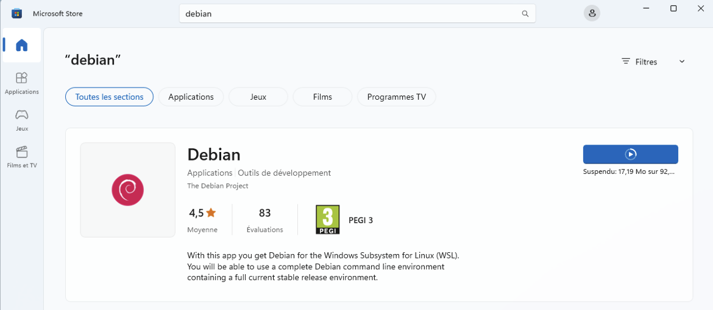
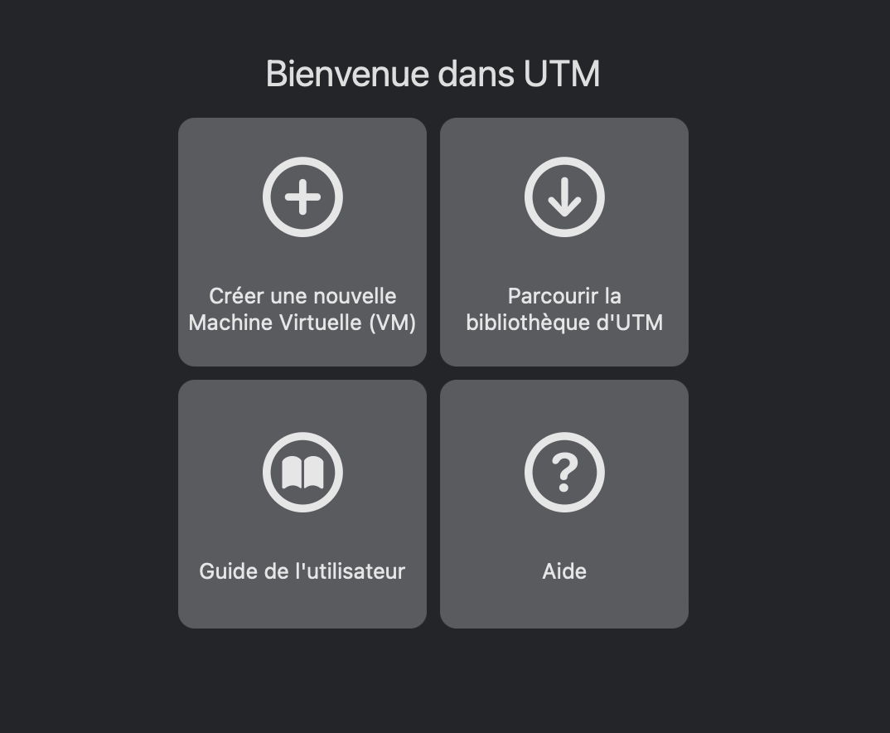
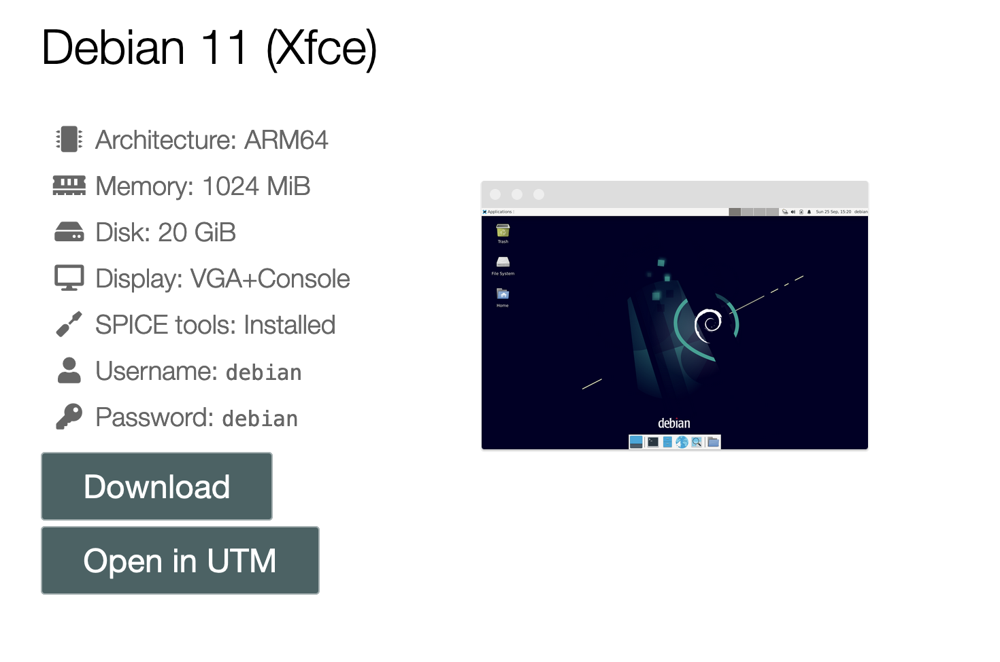
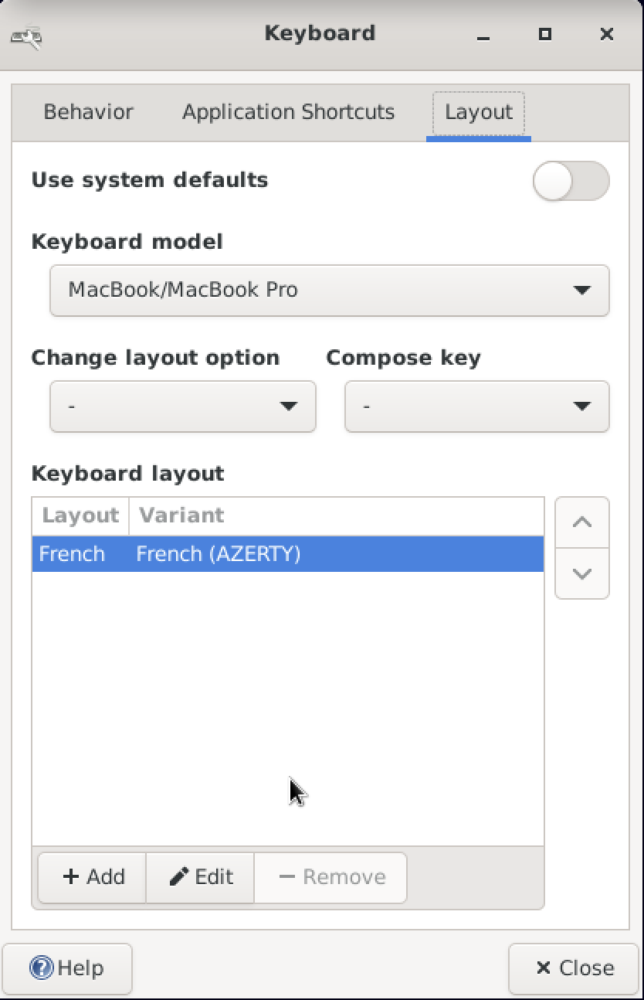
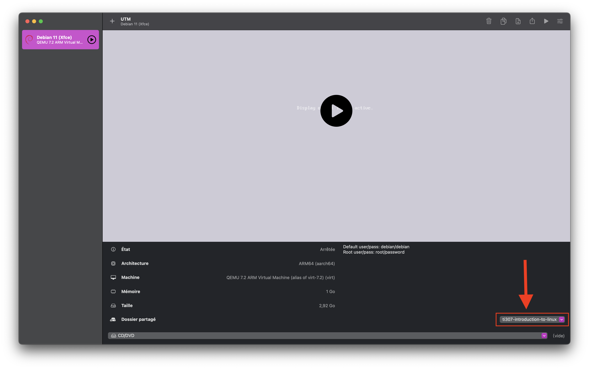

# Installation d'une distribution Linux

## Installation de WSL (pour les utilisateurs Windows)

Dans ce tutoriel nous verrons comment vous pouvez directement avoir un environnement Linux dans Windows en utilisant *Windows Subsystem for Linux* (WSL).

### Activation de wsl
1. Dans la barre de recherche de Windows, tapez *"Activer ou désactiver des Fonctionnalités Windows"*.

2. Une boîte de dialogue va s'ouvrir dans laquelle nous allons cocher des options.
3. Assurez-vous que les options **Sous-système Windows pour Linux** et **Plateforme de machine virtuelle** sont cochées et cliquez sur OK.

4. Il se peut que vous soyez invité à redémarrer votre ordinateur pour que les changements prennent effet.

### Installation de Debian

1. Ouvrez le *Microsoft Store* et tapez **debian** dans la barre de recherche. Une fois que **Debian** est proposé dans les suggestions, cliquez dessus.
2. Cliquez sur **Obtenir**.

3. Une fois le téléchargement terminé (environ 80 Mo), recherchez Debian dans la barre de recherche de Windows et cliquez dessus.
4. Un émulateur de terminal nommé *Debian* va s'ouvrir et finaliser l'installation.
5. Dans ce terminal, une fois l'installation terminée, on vous demandera de saisir un nom d'utilisateur et un mot de passe. Notez que pour des raisons de sécurité, le mot de passe que vous allez taper n'apparaîtra pas en clair, vous aurez peut-être l'impression de ne rien taper, mais en fait si.
6. Une fois votre nom d'utilisateur et votre mot de passe saisis, c'est tout ! Vous avez maintenant un système GNU/Linux (ligne de commande) installé dans Windows.

### Accéder aux fichiers wsl depuis Windows

1. Ouvrez un explorateur de fichiers depuis Windows.
2. Dans la barre d'adresse, tapez: `\\wsl$`, puis appuyez sur entrée.

3. Double cliquez sur Debian. À partir de là, vous pourrez accéder à votre répertoire personnel (dossier personnel) en cliquant sur `home` puis sur le dossier dont le nom est votre `login`.
4. Vous êtes maintenant en mesure de récupérer vos fichiers debian depuis Windows.
5. Pour tester que tout va bien, dans le terminal debian saisissez la commande suivante: 
```bash
touch file.txt
```
ensuite depuis l'explorateur de fichiers Windows vérifiez que le fichier a bien été créé dans votre répertoire personnel (il se peut que vous ayez besoin de rafraîchir la fenêtre avec `F5`).
6. Éditez le fichier `file.txt` dans un éditeur de texte depuis Windows, puis enregistrez-le.

7. Enfin, retournez dans le terminal debian pour vérifier que le fichier a bien été modifié. Saisissez la commande:
```bash
cat file.txt
```
8. Vous pourrez observer un petit problème avec la fin des lignes, Windows et Unix les gèrent différemment (nous en reparlerons plus tard).

## Installation de UTM (pour les utilisateurs MacOS)

Dans ce tutoriel nous verrons comment vous pouvez directement avoir un environnement Linux dans MacOS en utilisant *UTM*.

### Installation de UTM et de Debian

1. Télécharger l'application UTM depuis l'App Store. Ou directement depuis [ici](https://mac.getutm.app/). C'est un logiciel gratuit.
2. Une fois le téléchargement terminé, ouvrez l'application. Vous aurez une fenêtre qui ressemble à ceci:
   
3. Choisissez ensuite *Parcourir la bibliothèque d'UTM*, une liste de systèmes d'exploitation s'affichera.   
4. Choisissez une des distributions Debian 11 de votre choix (pour ce tuto j'ai choisi celle avec l'environnement graphique Xfce).
   
5. Cliquez ensuite sur le bouton *Open in UTM*, cela va télécharger l'image de la distribution Debian et l'installer sur votre ordinateur.
6. Après l'installation, revenez à l'application UTM, vous verrez la distribution Debian dans la liste des systèmes d'exploitation installés sur la gauche.
7. Cliquez sur la distribution Debian, puis sur le bouton *Play*.
8. Une nouvelle fenêtre va s'ouvrir et vous verrez afficher une fenêtre de connexion à Debian. Entrez votre nom d'utilisateur et votre mot de passe (le nom d'utilisateur par défaut est `debian` et le mot de passe par défaut est `debian`).
9. Faîtes attention au clavier, il peut être différent de celui auquel vous êtes habitué. Il s'agit par défaut du clavier QWERTY. Pour changer le clavier, voir la section suivante.

### Changer de clavier

1. Une fois passée la fenêtre de connexion, cliquez sur le bouton *Applications* en haut à gauche de l'écran. 
2. Une liste d'applications s'affichera, cliquez sur l'application *Settings*, puis sur *Keyboard*.
3. Vous aurez une fenêtre avec les paramètres du clavier, cliquez sur l'onglet *Layout*.
4. De là, modifiez le modèle du clavier en *MacBook/MacBook Pro* et sur l'option *Keyboard layout*, cliquez sur le bouton *Add* choisissez celui auquel vous êtes habitué (pour moi c'est *French (AZERTY)*).
5. Vous pouvez maintenant supprimer le clavier par défaut qui était le QWERTY.
6. Après la configuration, vous devriez avoir quelque chose de similaire à ceci:



Vous pouvez ensuite fermer la fenêtre, et maintenant vous pouvez utiliser le clavier auquel vous êtes habitué.

!!! warning "Sur l'écran de connexion"
    Sur l'écran de connexion le clavier restera celui par défaut c'est-à-dire le QWERTY. Vous devrez donc taper votre mot de passe avec le clavier QWERTY.

### Partager un dossier entre MacOS et Debian

Pour cette étape, vous aurez besoin d'avoir un dossier dans votre MacOS que vous voulez partager avec votre OS Debian. Pour ce tutoriel, j'utiliserai un dossier nommé `ti307-introduction-to-linux`.

1. Éteignez d'abord l'OS Debian en cliquant sur le bouton *Stop* dans l'application UTM.
2. Ensuite faîtes un clic droit sur l'OS Debian dans la liste des OS installés, puis cliquez sur le bouton *Modifier*.
3. Plusieurs options s'afficheront, nous allons nous concentrer sur l'option *Partage*.
4. Cliquez sur l'option *Partage*, puis au niveau de *Emplacement* cliquez sur le bouton *Parcourir*, selectionnez alors le dossier que vous souhaitez partager.
5. À la fin de la configuration, vous devriez arriver à un résultat similaire à ceci (avec biensûr le chemin de votre dossier):

    

6. Vous pouvez maintenant allumer votre OS Debian en cliquant sur le bouton *Play*.
7. Connectez-vous, puis sur le bureau vous devriez voir un *Disque de volume* nommé `share`. Double-cliquez dessus : ce dossier est désormais celui que vous avez partagé depuis MacOS.
8. Dans cet explorateur de fichier, faîtes un clic droit dans l'espace vide (du dossier), puis choisissez *Open in Terminal Here*. Ensuite tapez les commandes suivantes:

    ```bash
    cd ..
    sudo chmod 777 share
    cd share
    touch file.txt
    ``` 
    !!! note "`sudo` ?"
        - La commande `sudo` vous permet d'exécuter la commande qui la suit en tant qu'administrateur. On vous demandera votre mot de passe (une fois par session). 
        - La commande `chmod 777` permet de donner tous les droits sur le dossier `share` à tous les utilisateurs.

9. Revenez dans l'explorateur de fichier MacOS, vous devriez trouver le fichier `file.txt` dans le dossier que vous avez partagé. Éditez ce fichier à l'aide d'un éditeur de texte, puis enregistrez-le.
10. Revenez dans le terminal Debian, et tapez la commande suivante:
    ```bash
    cat file.txt
    ```
Si vous voyez le contenu de `file.txt` dans le terminal, tout s'est bien passé et à partir de maintenant vous pouvez partager des fichiers entre MacOS et Debian.

    !!! tip "Chemin vers le dossier partagé"
        Dans l'OS Debian, le chemin vers le dossier partagé est `/media/share`. Assurez-vous de vous en souvenir 😉


## Installation de paquets Debian avec `apt`

La plupart des distributions GNU/Linux permettent d'installer des programmes, des bibliothèques (ensemble de programmes), des logiciels précompilés en passant par des *dépôts* en ligne. Les programmes et bibliothèques présents dans ces dépôts sont appelés *paquets*.

L'installation de ces paquets est réalisée par un ... *gestionnaire de paquets*. Pour Debian et ses dérivés, le gestionnaire de paquets s'appelle `apt`.

Comme ces paquets sont installés sur le système, pour tous les utilisateurs, seul l'administrateur système est autorisé à les installer, mais vous pourrez prendre ce rôle.

!!! note "`sudo` ?"
    La commande `sudo` vous permet d'exécuter la commande qui la suit en tant qu'administrateur. On vous demandera votre mot de passe (une fois par session).

Nous allons donc procéder à l'installation de quelques paquets.

1. Dans un premier temps, mettez à jour la base de données et les paquets déjà installés en tapant dans votre terminal Debian:
```bash
sudo apt update
sudo apt upgrade
```
Cette étape peut prendre plus ou moins de temps en fonction de votre connexion internet.
2. Une fois les mises à jour terminées, nous allons installer 4 paquets: les éditeurs de texte `nano` et `vim`, le compilateur c `gcc` et une application de calendrier `ncal` avec la commande suivante:
```bash
sudo apt install nano vim gcc ncal
```
3. Par exemple, pour vérifier que `gcc` s'est bien installé, vous pouvez taper la commande suivante:
```bash
which gcc
```
Cette commande va vous retourner le chemin vers l'exécutable `gcc` installé sur votre système.
4. Il est également possible d'effectuer une recherche de paquets par nom ou mot-clé en utilisant l'action `search` de la commande `apt`. Par exemple,
``` bash
sudo apt search firefox
```
5. Pour supprimer / désinstaller un paquet, utilisez l'action `remove` de la commande `apt`:
```bash
sudo apt remove nano
```
6. Enfin, certaines bibliothèques deviennent inutiles une fois que les paquets qui les utilisaient ont été supprimés. L'action `autoremove` permet de faire le ménage en désinstallant les bibliothèques devenues inutiles.
```bash
sudo apt autoremove
```


