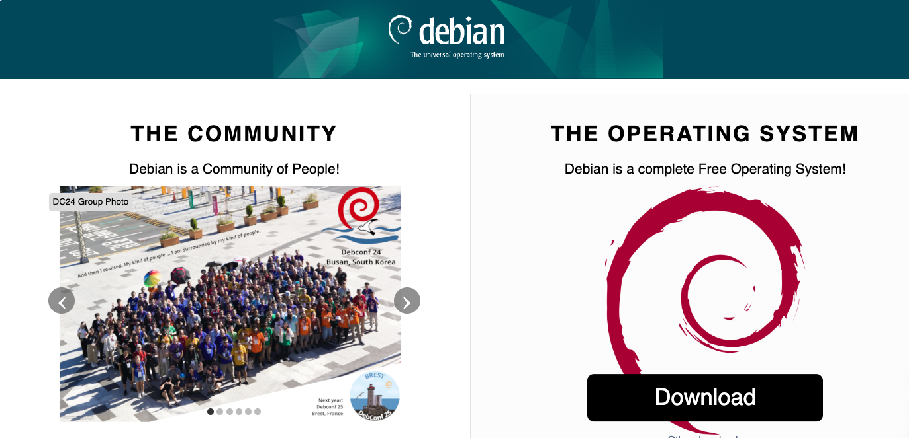
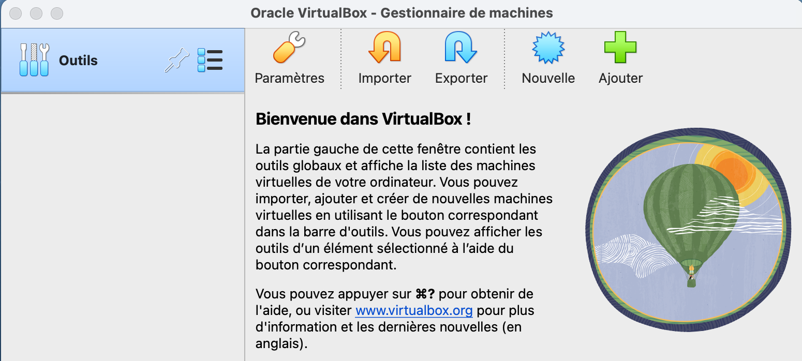
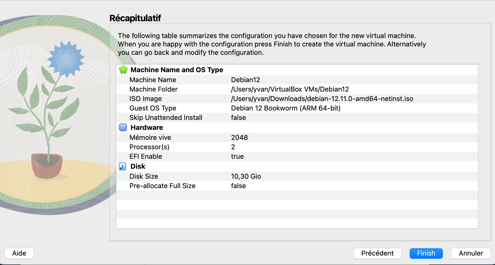
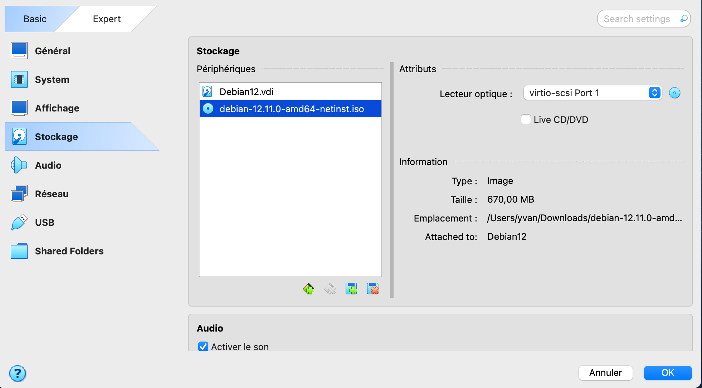
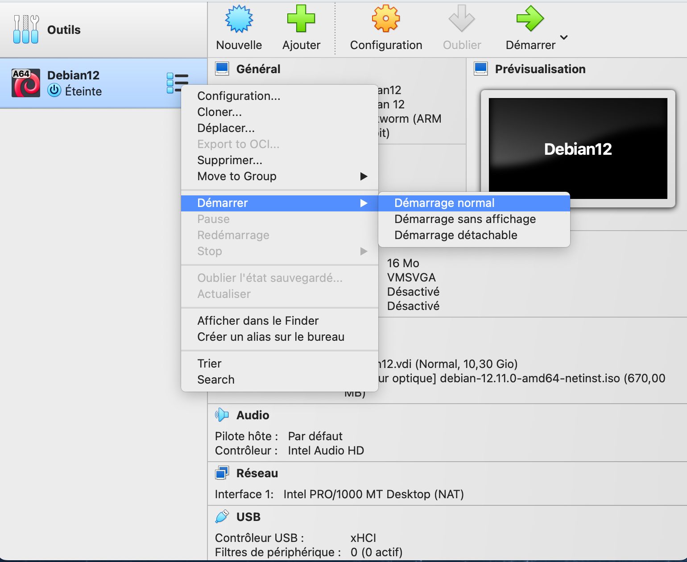

# Installation d'une distribution Linux via VirtualBox

Dans ce tutoriel, vous allez apprendre à installer une distribution Linux (Debian 12) dans une machine virtuelle à l’aide du logiciel **VirtualBox**.

## Prérequis

Avant de commencer, assurez-vous d’avoir :

- Une connexion internet stable
- Au moins **10 Go d’espace libre**
- **VirtualBox** installé sur votre système (Windows/macOS/Linux)
- Le fichier **ISO** de Debian (image disque)

---

## Étape 1 : Télécharger VirtualBox

1. Allez sur le site officiel : [https://www.virtualbox.org](https://www.virtualbox.org)
2. Cliquez sur le bouton **Download VirtualBox**.

3. Choisissez la version adaptée à votre système d’exploitation (Windows, macOS, Linux).

4. Une fois le fichier téléchargé, **installez VirtualBox** en suivant l’assistant d’installation.

!!! info "Extension Pack"
    Il est recommandé d’installer le "VirtualBox Extension Pack" pour bénéficier de fonctions supplémentaires comme le copier-coller entre hôte et invité.

---

## Étape 2 : Télécharger l’image ISO de Debian

1. Rendez-vous sur : [https://www.debian.org/](https://www.debian.org/)
2. Téléchargez la version 64 bits (amd64) : **debian-12.11.0-amd64-netinst.iso**



---

## Étape 3 : Créer une machine virtuelle

1. Lancez VirtualBox et cliquez sur **"Nouvelle"**.



2. Donnez un nom à votre machine virtuelle (par exemple "**Debian12**").

3. Choisissez :
   - **Type :** Linux
   - **Version :** Debian (64-bit)


4. Cliquez sur **"Suivant"**.

---

## Étape 4 : Allouer de la mémoire vive (RAM)

1. Allouez au moins **2048 Mo** (2 Go) si vous avez assez de RAM.

!!! tip "Recommandation"
    Ne dépassez pas 50 % de votre mémoire totale.


---


## Étape 5 : Créer un disque dur virtuel

1. Choisissez **"Créer un disque dur virtuel maintenant"**.
2. Laissez le type **VDI** (VirtualBox Disk Image) par défaut.
3. Choisissez **allocation dynamique**.
4. Définissez une taille de disque de **10 Go ou plus**.

5. Vérifier les paramètres de vos **"Configurations"**.
6. Ensuite cliquer sur "**Finish**"


## Étape 6 : Insérer l’image ISO

1. Une fois la VM créée, sélectionnez-la et cliquez sur **"Configuration"**.


2. Allez dans l’onglet **"Stockage"**.

3. Cliquez sur le lecteur vide et sélectionnez **"Choisir un fichier disque"**.

4. Sélectionnez l’ISO Debian téléchargé.




## Étape 7 : Démarrer l’installation de Debian

1. Cliquez sur **"Démarrer"** pour lancer la VM.
2. L’installateur Debian va apparaître. Choisissez **Install**.

3. Suivez les étapes :
    - Choisissez la langue, la localisation, le clavier
    - Configurez le réseau (vous pouvez laisser DHCP par défaut)
    - Créez un compte utilisateur + mot de passe
    - Choisissez **Utiliser le disque entier** pour le partitionnement
    - Confirmez l’installation

!!! warning "Attention"
    Toutes les données seront effacées sur le disque virtuel — ce n’est pas grave, c’est une machine isolée.

---

## Étape 8 : Terminer l’installation

1. Une fois l’installation terminée, Debian redémarre.
2. Pensez à retirer l’ISO de l’installation :
   - Allez dans **"Périphériques" > "Lecteurs optiques" > "Retirer le disque"**

<!--


3. Vous devriez arriver sur l’écran de connexion de Debian 🎉
-->

---

## Étape 9 : Premier test

1. Connectez-vous avec votre nom d’utilisateur/mot de passe.

2. Testez quelques commandes :
```bash
whoami
ls /
uname -a
```
