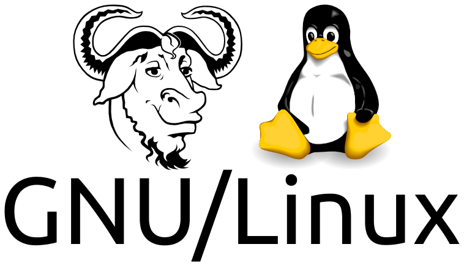
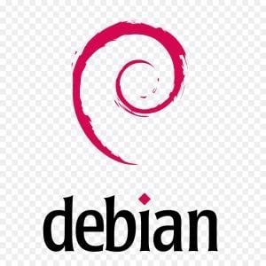

In this introductory course, we will learn how to use the Linux operating system through the Debian distribution. We will learn how to use the command-line interface (CLI) and the shell to interact with the operating system. We will also learn how to use the shell to write scripts and automate tasks.

This first preliminary reading helps you understand the origins of Linux and grasp the philosophy behind this operating system. It also explains why it is so popular, even if you have never heard of it before. Yes, you may not know it, but you already use it every day. A definition of a shell is also provided.

### What is an operating system?

According to Wikipedia, the free encyclopedia, an operating system (OS) is software that manages the computer's hardware and software resources and provides common services for computer programs.

It receives requests to use the computer's resources — memory storage resources (e.g., accessing RAM, hard drives), central processor computing resources, communication resources to peripherals (e.g., requesting GPU computing resources or from any other expansion card) or over the network — from application software. The operating system manages these requests and the necessary resources to avoid interference between software applications.

### What is UNIX?

UNIX is an operating system (OS) originally developed by Ken Thompson at Bell Labs, the legendary research branch of AT&T (the former American telecommunications monopoly) in 1969, and was considerably improved at the University of California at Berkeley (UCB) during the 1970s and 1980s. Many variations were subsequently developed, and they are collectively referred to as Unix-like or Unix-based operating systems. Unix-based operating systems are widely regarded as the best operating systems ever created in terms of several criteria, including stability, security, flexibility, scalability, and elegance.

### What are Linux and GNU/Linux?

Linux is a free and high-performance operating system (OS) similar to UNIX. Linus Torvalds started Linux (a concatenation of Linus and UNIX) in 1991, with the goal of creating a free UNIX alternative due to his dissatisfaction with MS-DOS. It quickly became a global project, attracting developers from around the world [^1], which led to continuous performance improvements and widespread adoption by individuals, businesses, educational institutions, and governments.

Linux's superiority over other Unix-like systems lies in the fact that it is completely free, both in terms of cost and usage rights. This freedom is made possible by the [GNU General Public License (GPL)](https://en.wikipedia.org/wiki/GNU_General_Public_License), associated with the GNU project launched by Richard Stallman in 1983, which provides essential utility programs for Linux — hence the name GNU/Linux.

Compared to Microsoft Windows, the most widely used operating system, Linux offers several advantages: (1) being free of charge, (2) high stability with fewer crashes, (3) strong resistance to viruses and malware, (4) the availability of many high-quality free software, and (5) compatibility with older computers unable to support new versions of Windows. For a more comprehensive list of advantages, the article ["25 Reasons to Convert to Linux"](http://www.linfo.org/reasons_to_convert.html) can provide more information.

### What is a Linux distribution?

A distribution is a complete operating system consisting of a *kernel* (i.e., the core of an operating system) and utilities (some of which are also required for the operating system to function) along with a variety of application programs.

There are about a hundred Linux distributions currently available. They come in various flavors, from the most beginner-friendly to the most advanced for experts. The most popular ones include Ubuntu, Fedora, and Debian.

Most of these distributions are available (1) in English, (2) for Intel-compatible processors (x86), and (3) as free downloads on the Internet. They are also available (4) in other languages and (5) for other types of processors.

In this module, we will begin our Linux journey with Debian.

### What is Debian?

Debian is a free operating system (OS) based on a UNIX-like kernel (Linux or FreeBSD) that can be downloaded [here](https://www.debian.org/download). You can find more information about Debian [here](https://www.debian.org/intro/about).

### Timeline of UNIX and Linux development

- 1969: Ken Thompson develops the first version of UNIX at Bell Labs.
- 1973: UNIX is rewritten in the C programming language, greatly increasing its portability.
- 1983: Richard Stallman launches the GNU project to create a free UNIX-like operating system providing many utilities.
- 1985: The Free Software Foundation is founded to support the GNU project.
- 1987: Andrew Tanenbaum develops MINIX, a free UNIX-like operating system for educational purposes.
- 1991: Linus Torvalds launches Linux as a hobby project.
- 1992: Linux is re-licensed under the GNU GPL.
- 1993: The Debian project is founded to create a free UNIX-like operating system.

### UNIX today

- **GNU/Linux** Linux kernel + GNU utilities, powers most servers and supercomputers, and is increasingly used on desktops and laptops (1% to 2%).
- **Android** Linux kernel + Android utilities, powers most smartphones and tablets (80%).
- **FreeBSD** UNIX-like OS, powers most Apple Macintosh computers (10%), and the PlayStation 3 and 4 OS.
- **iOS and macOS** UNIX-like OS, powers Apple iPhones, iPads, and Macs.

### But what about the shell?

We have seen that an OS manages requests to use the computer's resources. These requests are made through a user interface. There are two types of user interfaces: (1) graphical user interfaces (GUI) and (2) command-line user interfaces (CLI).

A shell is a program that provides the traditional, text-only user interface for Unix-like operating systems. Its main function is to read commands (i.e., instructions) that are typed into a console (i.e., an all-text display mode) or a terminal window (i.e., a graphical display mode), and then execute them.

In this module, we will use the Bash shell. Bash is the shell of the GNU project. Bash is the Bourne Again SHell. Bash is an sh-compatible shell that incorporates useful features from the Korn shell (ksh) and the C shell (csh). It is intended to conform to the IEEE POSIX P1003.2/ISO 9945.2 Shell and Tools standard. It offers functional improvements over sh for both programming and interactive use. Moreover, most sh scripts can be run by Bash without modification.

[^1]: Later, Linus Torvalds would invent Git to manage the development of the Linux kernel, as its development had spread worldwide.
