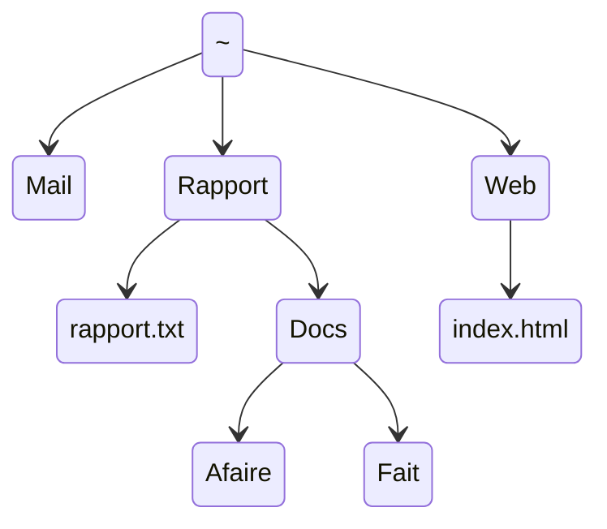

# TP1 — Premières commandes

!!! objectifs "Objectifs pédagogiques (taxonomie de Bloom révisée)"
    À l’issue de ce TP, vous serez capable de :

    - **[Comprendre]** ce qu’est une commande shell, distinguer commandes internes / externes / alias / fonctions.
    - **[Appliquer]** vous déplacer dans l’arborescence du système de fichiers Linux (`pwd`, `cd`, `ls`).
    - **[Appliquer]** créer, déplacer, copier, renommer et supprimer fichiers et répertoires (`mkdir`, `touch`, `mv`, `cp`, `rm`, `rmdir`).
    - **[Appliquer]** utiliser les raccourcis clavier essentiels du terminal (<kbd>↑</kbd>, <kbd>Ctrl-L</kbd>, <kbd>Ctrl-U</kbd>, <kbd>Ctrl-D</kbd>, <kbd>Tab</kbd>).
    - **[Appliquer]** consulter l’aide en ligne (`man`, `help`) et lire un SYNOPSIS.
    - **[Analyser]** distinguer chemins absolus et chemins relatifs, et prédire le résultat d’une commande utilisant des jokers (`*`, `?`, `[]`).
    - **[Évaluer]** choisir la commande et l’option appropriées à un besoin donné.

    > **Référence** : Anderson, L. W., & Krathwohl, D. R. (2001). *A Taxonomy for Learning, Teaching, and Assessing: A Revision of Bloom's Taxonomy*. Longman. ISBN 978-0801319037.

!!! tip "Prérequis"
    - Lecture préliminaire effectuée ([preliminary-reading](./preliminary-reading.md)).
    - Distribution Debian 12 installée ([installation-wsl](./installation-wsl.md)) **ou** session MarioNum active ([Intro-MarioNum](./Intro-MarioNum.md)).
    - Terminal ouvert et prompt `$` visible.

!!! info "Instructions"
    - Dans tous les exercices, la chaîne `$ ` en début de ligne représente l’invite de commande et **ne doit pas** être saisie.
    - À chaque nouveau terminal, pour des raisons pédagogiques, saisissez :
      ```bash
      $ PS1='$ '
      ```

!!! warning "À propos des réponses du TP"

    Avant de commencer, créez un fichier nommé **`resultat_commande_TP1_NomPrenomEtudiant.txt`**.
    Vous y consignerez progressivement les résultats des commandes exécutées.

    > **Création du fichier**

    1. Clic droit dans votre répertoire de travail
    2. Créer un document → Fichier vide
    3. Nommez : `resultat_commande_TP1_NomPrenomEtudiant.txt`

    > **Notez bien :**
    >> - <span style="color:blue"> Votre enseignant doit pouvoir consulter ce fichier à tout moment afin d’évaluer votre progression. </span>

    >> - <span style="color:red"> Sauvegardez ce fichier résultat **en local** avant la fin de la séance. </span>
    >>> **Procédure de sauvegarde en local** :
        1. Cliquez sur le **presse-papier** (à gauche du Bureau de la machine virtuelle).
    
        2. Sélectionnez le contenu et copiez.
        3. Collez dans un nouveau fichier sur votre machine hôte.

!!! tip "Barème d’interprétation des exercices"
    > 📚 = Facile · 📚📚 = Moyenne · 📚📚📚 = Élevée
    >
    > Les exercices **1 à 7** constituent le **tronc commun**, exigible pour tous.
    > Les exercices **8, 9, 10** sont des **exercices supplémentaires** (⭐).

!!! info "Alignement avec les évaluations (Biggs, 1996)"
    Les exercices 📚 et 📚📚 préparent au **CC S38** et au **TP noté S40**.
    Les exercices 📚📚📚 préparent au **DE S42 (QCM)** par leur dimension d’analyse et de justification.

    > **Référence** : Biggs, J. (1996). Enhancing teaching through constructive alignment. *Higher Education*, 32(3), 347–364. DOI : [10.1007/BF00138871](https://doi.org/10.1007/BF00138871).

---

## 1. Anatomie d’une commande, raccourcis clavier

!!! tip "Qu’est-ce qu’une commande ?"
    Une **commande** est une séquence de mots terminée par <kbd>Entrée</kbd>. Le premier mot est le **nom** de la commande, les autres sont ses **arguments**.

    ```bash
    $ touch file.txt
    ```

    Ici, `touch` est la commande et `file.txt` son unique argument. Les mots sont séparés par un ou plusieurs espaces ; le shell interprète les espaces comme des séparateurs, et le caractère *nouvelle ligne* comme la fin de la commande.

### Exercice 1 — Premières commandes et raccourcis clavier 📚

1. Essayez les commandes suivantes dans un terminal. Pour chacune, décrivez en une phrase son utilité, indiquez son nom, son nombre d’arguments et ses arguments. *Exemple* : la commande `date` n’a pas d’argument et affiche la date et l’heure.
   ```bash
   $ date
   $ cal
   $ cal 3 2022
   $ who
   $ who am i
   $   who  am   i
   $ uname
   $ uname -m -r
   $ uname -mrs
   $ echo Hello, world!
   $ echo       Hello,        world!
   ```
2. Appuyez sur <kbd>↑</kbd> (ou <kbd>Ctrl-P</kbd>) plusieurs fois jusqu’à ce que la commande `who` s’affiche. Appuyez maintenant sur <kbd>↓</kbd> (ou <kbd>Ctrl-N</kbd>) jusqu’à revenir sur `uname -m -r`, puis exécutez. Notez à quoi servent ces raccourcis.
3. Appuyez sur <kbd>Ctrl-L</kbd>. Notez à quoi sert ce raccourci.
4. Sans écrire la commande, faites afficher `cal 3 2022`, **sans l’exécuter**.
5. Appuyez sur <kbd>Ctrl-U</kbd>. Notez à quoi sert ce raccourci.
6. Faites afficher `uname`, sans l’écrire ni l’exécuter, puis appuyez sur <kbd>Ctrl-D</kbd>. Que se passe-t-il ?
7. Effacez la ligne avec un raccourci clavier, puis appuyez à nouveau sur <kbd>Ctrl-D</kbd>. Que se passe-t-il ?
8. Ouvrez un nouveau terminal Debian et appuyez plusieurs fois sur <kbd>Ctrl-P</kbd>. Qu’observez-vous ?
9. Fermez le terminal avec un raccourci clavier.

---

## 2. Répertoires et fichiers : se repérer

!!! tip "Le shell dans son environnement"
    Chaque terminal se trouve **dans** un répertoire : son *répertoire courant* (ou *répertoire de travail*). Trois commandes essentielles :

    - `pwd` (*print working directory*) : affiche le chemin absolu du répertoire courant.
    - `cd <chemin>` (*change directory*) : se déplace.
      - `cd` seul → répertoire personnel.
      - `cd ..` → répertoire parent.
      - `cd -` → répertoire précédent.
    - `ls [<chemin>]` : liste le contenu d’un répertoire.

    Le caractère `~` (*tilde*) est un raccourci pour le répertoire personnel de l’utilisateur.

### Exercice 2 — Se repérer dans l’arborescence 📚📚

1. Ouvrez un terminal et tapez `PS1='$ '`.
2. Entrez `pwd` et notez ce qui est affiché : c’est le chemin absolu de votre *home*.
3. Entrez `cd ..` puis `pwd`. Répétez jusqu’à ce que le résultat reste le même. Que s’est-il passé ?
4. Entrez `cd` (sans argument), puis `pwd`. Commentez.
5. Entrez `cd /`, puis `pwd` et `ls`. À quoi sert `ls` ?
6. Entrez `cd /usr/include` puis `ls`. À quoi semble servir ce répertoire ?
7. Rappels :
   - `cat` *(concatenate)* affiche les fichiers donnés en arguments.
   - `wc` *(word count)* affiche les nombres de lignes, mots, caractères.

   Affichez le contenu du fichier `stdlib.h` et son nombre de lignes.
8. Entrez `cd ..`, `pwd` et `ls`.
9. Entrez `cd share/man`, puis `pwd` et `ls`. À quoi se réfèrent certains résultats ?
10. Entrez `ls /bin`. Certains noms vous sont-ils familiers ?
11. Entrez `echo ~`, puis `cd ~`. Que fait le shell au caractère `~` ?
12. Représentez sous forme d’arbre les répertoires et fichiers mentionnés dans cet exercice.

!!! warning "Où se trouve `~` sur le clavier ?"
    - Azerty Windows : <kbd>Alt Gr</kbd> + <kbd>2</kbd>
    - Mac : <kbd>Alt</kbd> + <kbd>N</kbd>

---

## 3. Gérer répertoires et fichiers

!!! tip "Chemins absolus et relatifs"
    Sous Linux, les répertoires sont séparés par `/` (contre `\` sous Windows).

    - **Chemin absolu** : commence par `/`, valable en tout contexte. Ex. : `/home/debian`.
    - **Chemin relatif** : interprété depuis le répertoire courant. Ex. : `./Documents` depuis `/home/debian` → `/home/debian/Documents`.
    - **`.`** = répertoire courant · **`..`** = répertoire parent · **`~`** = répertoire personnel.

### Exercice 3 — Créer, déplacer, copier, supprimer 📚📚

1. Placez-vous dans votre répertoire personnel et listez son contenu.
2. Créez un répertoire `tp_shell` avec `mkdir`. Listez le contenu du répertoire personnel et de `tp_shell`.
3. Entrez `mkdir abeilles tp_shell/tp1 ~/arbres`. Quels arguments sont absolus, lesquels sont relatifs ?
4. Que fait la commande suivante ?
   ```bash
   $ mkdir -p vivant/plante/fleur tp_shell/tp1/exos/ex1/
   ```
5. Testez la **complétion automatique** avec la touche <kbd>Tab</kbd> :
   ```bash
   $ mkd<Tab> vi<Tab><Tab><Tab>roses
   ```
   Puis :
   ```bash
   $ ls a<Tab><Tab>
   ```
6. Supprimez des répertoires vides avec `rmdir` :
   ```bash
   $ rmdir vivant tp_shell/tp1/exos/ex1
   ```
   Supprimez également le sous-répertoire `tp1` de `tp_shell`.
7. Créez des fichiers vides avec `touch` :
   ```bash
   $ touch ~/arbres/hello.c abeilles/truc.txt bidule
   $ ls ~/arbres abeilles/ .
   ```
8. Déplacez / renommez avec `mv` :
   ```bash
   $ mv arbres/hello.c arbres/bonjour.c
   $ mv abeilles arbres vivant/
   $ mv bidule vivant
   $ mv vivant vie
   ```
9. Copiez avec `cp` :
   ```bash
   $ cp vie/arbres/bonjour.c salut.c
   $ mkdir copies
   $ cp salut.c vie/abeilles/truc.txt copies
   $ cp -R vie copie_vie
   ```
   Décrivez le comportement de `cp` selon que son dernier argument est un répertoire existant ou non, avec/sans `-R`.
10. Supprimez avec `rm` :
    ```bash
    $ rm vie/bidule
    $ rm -r copies
    $ rm -R copie_vie
    ```
    Nettoyez tous les fichiers et répertoires créés dans cet exercice.

!!! warning "`rm` est définitif"
    En ligne de commande sous Linux, **il n’y a pas de corbeille**. Avant `rm -r`, vérifiez `pwd` et `ls`.

### Exercice 4 — Construire une arborescence structurée 📚📚📚

Créez l’arborescence suivante depuis votre répertoire personnel. Seuls `rapport.txt` et `index.html` sont des fichiers normaux. Les répertoires **Mail**, **Rapport** et **Web** seront créés **en une seule commande** `mkdir`.



Utilisez `touch` pour créer les fichiers normaux, puis un éditeur de texte pour leur donner un contenu.

Depuis votre répertoire personnel, exécutez :

1. Allez directement dans `~/Rapport/Docs/Afaire`.
2. De là, allez dans `~/Rapport/Docs/Fait` et copiez-y `rapport.txt` (rappel : `.` désigne le répertoire courant).
3. Renommez cette copie `rapport_copie.txt`.
4. Revenez dans `~/Rapport`.
5. **Sans changer** de répertoire, affichez le contenu de `index.html` avec `cat`.
6. **Sans changer** de répertoire, listez le contenu du répertoire `Web`.
7. Revenez dans `~` et supprimez toute l’arborescence de cet exercice.

!!! info "Cet exercice est représentatif d’un item type **DE S42 (QCM)**."

---

## 4. Types de commandes et aide en ligne

!!! tip "Les différents types de commandes"
    Il existe plusieurs types :

    - **externes** : programmes compilés ou scripts installés sur le système ;
    - **internes** (*shell builtins*) : intégrées au shell ;
    - **fonctions du shell** : définies par l’utilisateur ;
    - **alias** : raccourcis pour des commandes.

    La commande `type` indique le type. Exemple :

    ```bash
    $ type type
    type is a shell builtin
    ```

### Exercice 5 — Internes vs externes 📚

1. Pour chaque commande utilisée dans les exercices précédents (y compris `type`), dites avec `type` à quelle catégorie elle appartient.
2. Devinez dans quels répertoires se trouvent la plupart des programmes installés.

!!! warning "Si `man` n’est pas installé (Debian / WSL)"
    Installez avec :
    ```bash
    $ sudo apt install manpages man-db
    ```

!!! tip "Les pages du manuel"
    `man` fournit l’aide des commandes **externes**. Pour les **internes**, utilisez `help`.

    Une page de manuel comporte notamment :

    - **NAME** — description en une ligne ;
    - **SYNOPSIS** — syntaxes acceptées ;
    - **DESCRIPTION** — options et arguments détaillés ;
    - éventuellement **EXAMPLES**.

### Exercice 6 — Obtenir l’aide 📚📚

1. Entrez `man ls`. Quelles sont les options `-l` et `-a` ? Quittez avec <kbd>q</kbd> et testez-les.
2. À l’aide du manuel, dites à quoi sert l’option `-f` de `rm` et comment supprimer un fichier dont le nom commence par un tiret (par exemple `-f`).
3. Avec `help`, affichez les pages d’aide des commandes internes `echo` et `type`.
4. Avec `man touch`, quelle est l’utilité de `touch` si ce n’est pas seulement de créer des fichiers vides ?
5. Avec `man man`, trouvez la partie qui parle des commandes internes. Dans quelle section les librairies sont-elles documentées (par exemple la libc) ? Quelle est la différence entre :
   ```bash
   $ man 1 printf
   $ man 3 printf
   ```
6. Dans le SYNOPSIS de `mv`, que signifient les crochets `[ ]` et les points de suspension `...` ? Consultez `man man` si besoin.

---

## 5. Caractères jokers

!!! tip "Caractères jokers (*wildcards*)"
    Les **jokers** représentent un ou plusieurs autres caractères. Ils sont interprétés par le shell **avant** l’exécution de la commande — c’est l’**expansion des chemins**.

    - `*` : chaîne éventuellement vide, **sauf** si c’est le premier caractère d’un nom commençant par un point.
    - `?` : un seul caractère quelconque.
    - `[...]` : un seul caractère parmi ceux listés. Intervalles : `[a-z]`, `[0-5]`. Inversion : `[^abc]`.

    Liste complète : voir la section **Pathname Expansion** du manuel de `bash` (`man bash`).

### Exercice 7 — Jokers 📚📚📚

1. Créez un répertoire `tp_joker` dans votre home. Placez-vous dedans. Créez les fichiers **vides** suivants :
   `annee1  Annee2  annee4  annee45  annee41  annee510  annee_saucisse  annee_banane  bonbon`
2. Sans les exécuter, prédisez le résultat des commandes suivantes, puis testez :
   ```bash
   $ echo *
   $ echo *_*
   $ echo [ab]*
   $ echo [^ab]*
   $ echo c*
   $ echo ??????
   ```
3. Avec `ls`, listez tous les fichiers qui :
   - se terminent par `5` ;
   - commencent par `annee4` ;
   - commencent par `annee4` et ont au maximum 7 lettres ;
   - commencent par `annee` et dont le sixième caractère n’est **pas** un chiffre ;
   - contiennent la chaîne `ana` ;
   - commencent par `a` **ou** `A` ;
   - dont l’avant-dernier caractère est `4` **ou** `1`.
4. Listez tous les fichiers cachés (nom commençant par `.`) de votre répertoire personnel.
5. Listez tous les fichiers dont le nom commence par `std` et se termine par `.h` dans `/usr/include`.

!!! info "Cet exercice est représentatif d’un item type **DE S42 (QCM)**."

---

## Synthèse — Ce que vous devez savoir faire

!!! success "Auto-évaluation rapide (tronc commun)"
    Avant de quitter la séance, vérifiez que vous savez :

    - [ ] Identifier le nom, les options et les arguments d’une commande.
    - [ ] Utiliser les raccourcis <kbd>↑</kbd>, <kbd>Ctrl-L</kbd>, <kbd>Ctrl-U</kbd>, <kbd>Ctrl-D</kbd>, <kbd>Tab</kbd>.
    - [ ] Distinguer chemin absolu et chemin relatif.
    - [ ] Créer, déplacer, copier, renommer et supprimer fichiers et répertoires.
    - [ ] Utiliser `type`, `man`, `help` et lire un SYNOPSIS.
    - [ ] Prédire le résultat d’une expansion de chemin avec `*`, `?`, `[]`.

    Si un item n’est pas coché, **revenez sur l’exercice correspondant** avant le TP2.

---

## ⭐ Exercices supplémentaires

!!! star "À qui s’adressent les exercices 8, 9, 10 ?"
    Vous avez terminé les exercices 1 à 7 avant la fin de la séance ? Ces trois exercices **approfondissent les concepts du TP1** en vous faisant découvrir la recherche avancée avec `find`, les liens symboliques et physiques, et l’écriture de votre premier script shell.

    Les niveaux taxonomiques visés sont **[Analyser]**, **[Évaluer]** et **[Créer]** (Bloom révisé).

    Ces exercices sont **optionnels** et **non évalués**.

### Exercice 8 — Recherche avancée avec `find` ⭐

!!! tip "La commande `find`"
    `find` parcourt récursivement une arborescence et sélectionne les fichiers selon des **critères** : nom, type, taille, date de modification, etc. Contrairement aux jokers (exercice 7), `find` descend dans les sous-répertoires.

    ```bash
    $ find <chemin> <critères> [<action>]
    ```

    Consultez `man find` pour la liste complète des critères.

1. Listez **tous les fichiers** (pas les répertoires) présents sous `/etc` :
   ```bash
   $ find /etc -type f
   ```
   Estimez combien il y en a en observant la sortie.

2. Trouvez tous les fichiers dont le nom se termine par `.conf` sous `/etc` :
   ```bash
   $ find /etc -name "*.conf"
   ```
   Pourquoi les guillemets autour de `"*.conf"` sont-ils indispensables ?

3. Trouvez tous les répertoires sous `/usr` dont le nom contient `bin`.

4. Trouvez dans `/var/log` les fichiers modifiés il y a **moins de 24 heures** :
   ```bash
   $ find /var/log -type f -mtime -1
   ```

5. **Combinaison de critères** : trouvez sous `/etc` les fichiers réguliers dont le nom commence par `host` et qui font plus de 100 octets :
   ```bash
   $ find /etc -type f -name "host*" -size +100c
   ```

6. **Question d’analyse** : quelle différence fondamentale y a-t-il entre `ls /etc/*.conf` et `find /etc -name "*.conf"` ? Testez les deux et comparez le résultat.

### Exercice 9 — Liens symboliques et liens physiques ⭐

!!! tip "Deux types de liens sous Linux"
    La commande `ln` crée des **liens** vers des fichiers existants :

    - **Lien physique** (*hard link*) : `ln fichier lien` — crée un second nom pour le **même contenu** sur le disque. Les deux noms sont équivalents ; supprimer l’un ne supprime pas l’autre.
    - **Lien symbolique** (*symlink*) : `ln -s cible lien` — crée un fichier spécial qui **pointe vers** un chemin. Si la cible est supprimée, le lien est « cassé ».

    Chaque fichier possède un **numéro d’inode** (identifiant interne). `ls -i` l’affiche.

    > **Référence** : Kerrisk, M. (2010). *The Linux Programming Interface*. No Starch Press. ISBN 978-1593272203, chap. 18 (*Directories and Links*).

1. Dans `~`, créez un répertoire `tp_liens/` et placez-vous dedans. Créez un fichier `original.txt` contenant quelques lignes (utilisez `echo` ou un éditeur).

2. Créez un **lien physique** :
   ```bash
   $ ln original.txt lien_physique.txt
   $ ls -li
   ```
   Comparez les numéros d’inode de `original.txt` et `lien_physique.txt`. Que constatez-vous ?

3. Modifiez le contenu de `lien_physique.txt` (avec `echo "nouvelle ligne" >> lien_physique.txt`). Affichez `original.txt`. Le contenu a-t-il changé ? Pourquoi ?

4. Créez un **lien symbolique** :
   ```bash
   $ ln -s original.txt lien_symbo.txt
   $ ls -li
   ```
   Comparez les numéros d’inode. En quoi diffèrent-ils de ceux du lien physique ?

5. Observez la différence avec `ls -l` :
   ```bash
   $ ls -l lien_physique.txt lien_symbo.txt
   ```
   Que montre la colonne de gauche pour le lien symbolique ? Que signifie la flèche `->` ?

6. Supprimez le fichier original :
   ```bash
   $ rm original.txt
   $ cat lien_physique.txt
   $ cat lien_symbo.txt
   ```
   Que se passe-t-il pour chacun des deux liens ? Expliquez la différence.

7. **Question d’analyse** : essayez de créer un lien physique vers un répertoire (`ln tp_liens/ lien_rep`). Que se passe-t-il ? Pourquoi Linux interdit-il cela ? *(Indice : pensez aux boucles dans l’arborescence.)*

8. Trouvez des exemples de liens symboliques sur le système :
   ```bash
   $ ls -l /usr/bin/python*
   $ ls -l /etc/alternatives/
   ```
   Pourquoi les distributions Linux utilisent-elles autant de liens symboliques ?

### Exercice 10 — Premier script shell ⭐

!!! tip "Qu’est-ce qu’un script shell ?"
    Un **script** est un fichier texte contenant une séquence de commandes exécutées par le shell. La première ligne, le **shebang**, indique quel interpréteur utiliser :

    ```bash
    #!/bin/bash
    ```

    Pour rendre un script exécutable : `chmod +x mon_script.sh`

    > **Référence** : Robbins, A., Hannah, E., & Lamb, L. (2008). *Learning the bash Shell*, 3rd ed. O’Reilly. ISBN 978-0596009656, chap. 1-2.

1. Dans `~`, créez un répertoire `scripts/` et placez-vous dedans.
2. Avec un éditeur (`nano`, `vim`…), créez `info-systeme.sh` :
   ```bash
   #!/bin/bash
   # Script d’information système — TP1 étoile

   echo "=== Informations système ==="
   echo "Date et heure  : $(date)"
   echo "Utilisateur    : $(whoami)"
   echo "Machine        : $(hostname)"
   echo "Noyau          : $(uname -r)"
   echo "Répertoire     : $(pwd)"
   echo ""
   echo "=== Contenu du répertoire courant ==="
   ls -la
   echo ""
   echo "=== Espace disque ==="
   df -h /
   ```
3. Rendez le script exécutable et lancez-le :
   ```bash
   $ chmod +x info-systeme.sh
   $ ./info-systeme.sh
   ```
4. **Exercice de création** : écrivez un script `creer-arbo.sh` qui :

       - Prend un **argument** : le nom d’un projet (ex. `mon_projet`).
       - Crée l’arborescence suivante :
     ```
     mon_projet/
     ├── src/
     ├── docs/
     ├── tests/
     └── README.txt    (contient "Projet : mon_projet")
     ```
      - Affiche un message de confirmation.

     *Indice* : pour accéder au premier argument dans un script, utilisez `$1`. Pour vérifier qu’un argument a été fourni :
     ```bash
        if [ -z "$1" ]; then
            echo "Usage : $0 <nom-du-projet>"
       exit 1
   fi
    ```

5. Testez votre script :
   ```bash
   $ ./creer-arbo.sh tp_linux
   $ ls -R tp_linux
   $ cat tp_linux/README.txt
   ```

6. **Question d’évaluation** : pourquoi est-il préférable de tester `[ -z "$1" ]` plutôt que de laisser le script échouer silencieusement sans argument ?

!!! info "Vers le TP2"
    Vous venez de découvrir `find`, les liens (`ln`, `ln -s`) et l’écriture de scripts shell. Au **TP2**, vous approfondirez les **permissions** et comprendrez ce que signifie `chmod +x` que vous avez utilisé ici.

---

## Pour aller plus loin (lectures recommandées)

- *Debian Reference* : <https://www.debian.org/doc/manuals/debian-reference/>
- *The Linux Documentation Project* : <https://tldp.org/>
- Robbins, A., Hannah, E., & Lamb, L. (2008). *Learning the bash Shell*, 3rd ed. O’Reilly. ISBN 978-0596009656.
- Shotts, W. (2019). *The Linux Command Line*, 2nd ed. No Starch Press. ISBN 978-1593279523. Disponible gratuitement : <https://linuxcommand.org/tlcl.php>.
