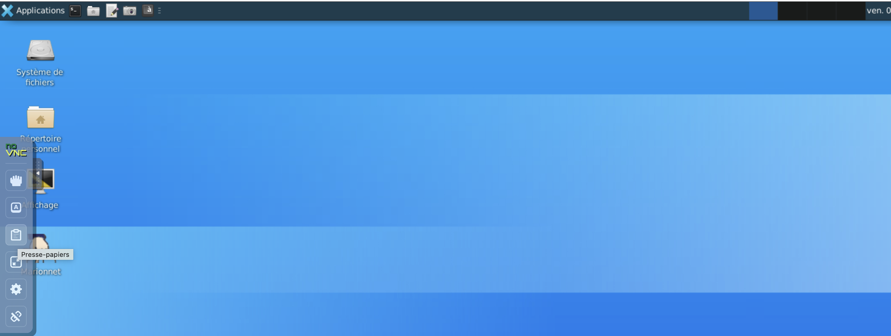

# TP2 — Système de fichiers et permissions

!!! objectifs "Objectifs pédagogiques (taxonomie de Bloom révisée)"
    À l’issue de ce TP, vous serez capable de :

    - **[Comprendre]** la structure hiérarchique du système de fichiers Linux (répertoires standards, `/etc/passwd`, notion d’utilisateur et de groupe).
    - **[Appliquer]** lire les permissions d’un fichier ou d’un répertoire (`ls -l`, `ls -ld`) en notations symbolique et octale.
    - **[Appliquer]** modifier les permissions avec `chmod` (notations symbolique et octale).
    - **[Analyser]** distinguer les permissions sur fichiers vs sur répertoires (`r`, `w`, `x`).
    - **[Analyser]** comprendre le rôle de la variable `PATH` dans la résolution des commandes.
    - **[Évaluer]** déterminer les permissions **minimales** nécessaires à une opération donnée.
    - **[Analyser]** comprendre et manipuler le masque `umask`.

    > **Référence** : Anderson, L. W., & Krathwohl, D. R. (2001). *A Taxonomy for Learning, Teaching, and Assessing*. Longman. ISBN 978-0801319037.

!!! tip "Prérequis"
    - **TP1 terminé** : navigation, création/manipulation de fichiers, consultation de `man`.
    - Distribution Debian 12 installée **ou** session MarioNum active.
    - Terminal ouvert et prompt `$` visible.

!!! info "Instructions"
    - Le `$` en début de commande représente le prompt et ne doit pas être saisi.
    - Pour chaque nouvelle commande, consultez `man` ou `--help`.

!!! warning "À propos des réponses du TP"

    Avant de commencer, créez un fichier nommé **`resultat_commande_TP2_NomPrenomEtudiant.txt`**.
    Vous y consignerez progressivement les résultats des commandes.

    > **Création du fichier**

    1. Clic droit dans votre répertoire de travail
    2. Créer un document → Fichier vide
    3. Nommez : `resultat_commande_TP2_NomPrenomEtudiant.txt`

    > **Notez bien :**
    >> - <span style="color:blue"> Votre enseignant doit pouvoir consulter ce fichier à tout moment. </span>

    >> - <span style="color:red"> Sauvegardez ce fichier **en local** avant la fin de la séance. </span>
    >>> **Procédure de sauvegarde en local** :
        1. Cliquez sur le **presse-papier** (à gauche du Bureau de la VM).
    
        2. Sélectionnez le contenu et copiez.
        3. Collez sur votre machine hôte.

!!! tip "Barème d’interprétation des exercices"
    > 📚 = Facile · 📚📚 = Moyenne · 📚📚📚 = Élevée
    >
    > Les exercices **1 à 7** constituent le **tronc commun**, exigible pour tous.
    > Les exercices **8, 9, 10** sont des **exercices supplémentaires** (⭐).

!!! info "Alignement avec les évaluations (Biggs, 1996)"
    Les exercices 📚 et 📚📚 préparent au **CC S38** et au **TP noté S40**.
    Les exercices 📚📚📚 préparent au **DE S42 (QCM)** par leur dimension d’analyse et de justification.

    > **Référence** : Biggs, J. (1996). Enhancing teaching through constructive alignment. *Higher Education*, 32(3), 347–364. DOI : [10.1007/BF00138871](https://doi.org/10.1007/BF00138871).

---

## 1. Système de fichiers Linux

??? saviezvous "Pourquoi `/etc` s'appelle `/etc` ?"
    Le répertoire `/etc` signifie littéralement **et cetera** — « et le reste ». Dans les premières versions d'Unix (1971, PDP-11), l'arborescence ne comptait que quelques répertoires : `/bin` pour les programmes, `/dev` pour les périphériques, `/usr` pour les utilisateurs… et `/etc` pour **tout ce qui ne rentrait nulle part ailleurs**. Les fichiers de configuration système y ont atterri par défaut. Ce nom, resté par convention, est aujourd'hui souvent réinterprété en *Editable Text Configuration*, mais cette étymologie est un **rétroacronyme** — l'original est bien « et cetera ».

    > Ritchie, D. M., & Thompson, K. (1978). The UNIX Time-Sharing System. *Bell System Technical Journal*, 57(6), 1905–1929. DOI : [10.1002/j.1538-7305.1978.tb02136.x](https://doi.org/10.1002/j.1538-7305.1978.tb02136.x)

!!! tip "Une arborescence unique"
    Le système de fichiers Linux est une **hiérarchie** partant de la racine `/`. Tous les répertoires sont des sous-répertoires de `/`. Contrairement à Windows, il n’y a pas de lettre de lecteur : disques et partitions sont **montés** dans l’arborescence unique.

    Un système Linux typique comporte des **dizaines de milliers** de fichiers système. La plupart ne sont utilisés que par le noyau ou les services. En pratique, ce qui vous concerne se trouve dans `/home` (fichiers personnels), `/tmp` (fichiers temporaires) et `/etc` (configuration).

    | Répertoire | Description |
    |---|---|
    | `/` | Racine de l’arborescence |
    | `/bin` | Programmes essentiels au fonctionnement du système |
    | `/boot` | Fichiers nécessaires au démarrage |
    | `/dev` | Fichiers spéciaux représentant les périphériques |
    | `/etc` | Fichiers de configuration du système |
    | `/home` | Répertoires personnels des utilisateurs |
    | `/lib` | Bibliothèques partagées, modules du noyau |
    | `/media`, `/mnt` | Points de montage de systèmes de fichiers |
    | `/opt` | Logiciels additionnels |
    | `/proc` | Système de fichiers virtuel : infos sur processus |
    | `/root` | Répertoire personnel de l’administrateur |
    | `/sbin` | Programmes d’administration système |
    | `/tmp` | Fichiers temporaires |
    | `/usr` | Programmes et bibliothèques (`/usr/bin`, `/usr/lib`…) |
    | `/var` | Fichiers variables (journaux, mails, bases…) |

    > **Référence** : *Filesystem Hierarchy Standard*, v3.0, The Linux Foundation, 2015. <https://refspecs.linuxfoundation.org/fhs.shtml>

### Exercice 1 — `id` et `/etc/passwd` 📚

1. Entrez la commande suivante et notez le résultat :
   ```bash
   $ id
   ```
2. Tapez la même commande avec l’argument `root` :
   ```bash
   $ id root
   ```
3. Affichez le contenu de `/etc/passwd` avec `cat`.
4. Recherchez les lignes correspondant à votre nom d’utilisateur et à `root`. Quelles sont les différences ?
5. Pouvez-vous déduire à quoi sert le fichier `/etc/passwd` ?

---

## 2. Permissions associées aux fichiers

!!! tip "Protection des fichiers"
    Un système Linux permet à plusieurs utilisateurs d’accéder aux fichiers. Pour les protéger, Linux utilise un système de **permissions** associées à trois catégories :

    - le **propriétaire** (`u` — *user*) : généralement le créateur du fichier ;
    - le **groupe** propriétaire (`g` — *group*) ;
    - les **autres** utilisateurs (`o` — *others*).

    Pour un **fichier ordinaire** :

    - **`r`** (*read*) : lecture du contenu ;
    - **`w`** (*write*) : modification du contenu ;
    - **`x`** (*execute*) : exécution (si programme ou script).

    L’option `-l` de `ls` affiche les métadonnées :

    ```bash
    $ ls -l fichier
    -rw-r--r-- 1 user group 0 2024-09-09 10:00 fichier # (i)
    ```

    1. De gauche à droite : **type** + permissions (`-rw-r--r--`), nombre de **liens** (`1`), **propriétaire** (`user`), **groupe** (`group`), **taille** en octets (`0`), **date** de dernière modification, **nom** du fichier.

    La chaîne `-rw-r--r--` se lit :

    - **1er caractère** : type (`-` fichier ordinaire, `d` répertoire, `l` lien symbolique…).
    - **caractères 2–4** : permissions du propriétaire.
    - **caractères 5–7** : permissions du groupe.
    - **caractères 8–10** : permissions des autres.

    Correspondance octale ↔ symbolique :

    | Chiffre | Lettre | Description |
    |---|---|---|
    | 0 | `---` | Aucune permission |
    | 1 | `--x` | Exécution |
    | 2 | `-w-` | Écriture |
    | 3 | `-wx` | Écriture et exécution |
    | 4 | `r--` | Lecture |
    | 5 | `r-x` | Lecture et exécution |
    | 6 | `rw-` | Lecture et écriture |
    | 7 | `rwx` | Lecture, écriture et exécution |

### Exercice 2 — Lire les permissions 📚

1. Créez un répertoire vide et un fichier vide, au même niveau. Avec `ls -l` et `ls -ld`, déterminez les permissions du propriétaire, du groupe et des autres. Comment reconnaissez-vous un répertoire ?
2. Les lignes suivantes donnent la réponse de `ls -ld` sur différents fichiers :
   ```text
   drwxr-xr-x a
   dr-xr--r-- b
   -rw-r--r-- c.txt
   --w--w-r-- d.c
   -rwxr-xr-x op
   ```
   Parmi ces fichiers, lesquels sont des **répertoires** ?
3. Pour chacun des fichiers ci-dessus, donnez les permissions en représentations **symbolique** et **octale**.
4. Donnez les représentations symbolique et octale des permissions de `/etc/passwd`, de la commande `ls` et de votre répertoire personnel.

### Exercice 3 — Modification des permissions `chmod` 📚📚

1. Testez les commandes suivantes et essayez de comprendre `chmod` en notation **symbolique** :
   ```bash
   $ touch f; ls -l f
   $ chmod a= f; ls -l f           # (i)
   $ chmod o+rw f; ls -l f         # (ii)
   $ chmod u=o f; ls -l f          # (iii)
   $ chmod o-wx f; ls -l f
   $ chmod g+u f; ls -l f          # (iv)
   $ chmod a+x,g-w f; ls -l f     # (v)
   ```

    1. `a` = **all** (u+g+o), `=` **fixe** les permissions exactes. Ici `a=` sans droit → retire **toutes** les permissions.
    2. `o` = *others*, `+` **ajoute** des droits. Ici : lecture et écriture pour les autres.
    3. `u=o` : le propriétaire (*user*) reçoit les **mêmes** permissions que les autres (*others*).
    4. `g+u` : le groupe reçoit les permissions **actuelles** du propriétaire.
    5. La virgule permet de combiner plusieurs modifications en une seule commande.

2. Testez et observez :
   ```bash
   $ chmod 644 f; ls -l f # (i)
   ```

    1. `644` en octal = `rw-r--r--` : lecture/écriture pour le propriétaire (`6` = `r`+`w`), lecture seule pour le groupe (`4` = `r`) et les autres (`4` = `r`).

    Que fait cette commande ?
3. Avec les **deux notations** (octale et symbolique), modifiez les permissions de `f` pour obtenir :

      - exécution pour tous, lecture et écriture uniquement pour le propriétaire ;
   - lecture et exécution pour tous, personne ne peut écrire ;
   - toutes les permissions pour tous, pas d’écriture pour les autres ;
   - lecture et écriture pour le propriétaire, exécution pour le groupe, aucune pour les autres.

### Exercice 4 — Effet des permissions sur les opérations 📚📚

1. Dans un répertoire de votre choix, créez deux fichiers `f` et `g`. Entrez du texte dans chacun avec un éditeur.
2. Pour vous (propriétaire) :

      - retirez la permission de **lire** dans `f` ;
      - retirez la permission d’**écrire** dans `g`.

3. Testez et notez les résultats :
   ```bash
   $ cat f
   $ cat g
   ```
4. Essayez de modifier `g` avec un éditeur de texte. Que se passe-t-il ?
5. Testez :
   ```bash
   $ cp f h
   $ cp g h
   ```
   Puis observez le contenu de `h` et ses permissions.
6. La commande suivante ajoute la chaîne `toto` à la fin de `f` (vu au TP4) :
   ```bash
   $ echo "toto" >> f
   ```
   Testez, puis redonnez-vous la lecture sur `f`, et affichez son contenu avec `cat`.
7. Testez :
   ```bash
   $ rm g
   ```
   **Tapez `n` pour refuser**. Puis testez :
   ```bash
   $ rm -f g
   ```
   La commande a-t-elle réussi ? Qu’en déduisez-vous ?

---

## 3. Permissions associées aux répertoires

??? saviezvous "Les inodes : l’invention qui sépare le nom du contenu"
    Le concept d’**inode** a été inventé par Dennis Ritchie et Ken Thompson pour le premier système de fichiers Unix (1971). L’idée fondamentale : le **nom** d’un fichier et ses **données** sont des choses distinctes. Le nom est stocké dans le répertoire parent, les métadonnées (permissions, taille, dates) dans l’inode, et le contenu dans des blocs disque séparés. Cette séparation rend possibles les liens physiques (plusieurs noms → même inode) et explique pourquoi renommer un fichier est instantané (on ne touche qu’à l’entrée du répertoire, pas aux données).

    > Bach, M. J. (1986). *The Design of the UNIX Operating System*. Prentice Hall. ISBN 978-0132017992. Chapitre 4.

!!! tip "Qu’est-ce qu’un répertoire ?"
    Un **répertoire** est une table associant des noms de fichiers à un numéro d’index appelé **inode**. L’inode contient les métadonnées (taille, permissions, horodatage, emplacement du contenu).

    Pour un **répertoire**, la sémantique des permissions diffère de celle d’un fichier :

    - **`r`** : permet de **lister** le contenu du répertoire.
    - **`w`** : permet de **modifier** le contenu (créer ou supprimer des fichiers).
    - **`x`** : permet d’**entrer** dans le répertoire (avec `cd`) et de traverser vers ses fichiers.

    > **Référence** : Bach, M. J. (1986). *The Design of the UNIX Operating System*. Prentice Hall. ISBN 978-0132017992. Chapitre 4 (Internal Representation of Files).

### Exercice 5 — Permissions sur les répertoires 📚📚📚

1. Créez un répertoire `rep` et deux fichiers normaux `a` et `b` à l’intérieur.
2. Retirez **toutes** les permissions sur `rep` et essayez :
   ```bash
   $ cd rep
   $ ls rep
   $ cat rep/a
   $ touch rep/c
   $ rm rep/a
   ```
3. Redonnez uniquement la permission `r` sur `rep` et refaites les commandes. Notez les différences.
4. Même question avec uniquement `w` sur `rep`. Notez les différences.
5. Uniquement `x` sur `rep` :
   ```bash
   $ cd rep
   $ ls rep
   $ echo "toto" >> rep/a
   $ cat rep/c
   $ ls -l rep/a
   $ touch rep/c
   $ rm rep/a
   ```
6. Avec `-wx` sur `rep` pour tous, essayez de :

      - créer un fichier `d` dans `rep` ;
   - renommer `b` ;
   - retirer toutes les permissions sur `d` ;
   - supprimer `d`.

!!! info "Cet exercice est représentatif d’un item type **DE S42 (QCM)**."

---

## 4. Le `PATH`

!!! tip "La variable d’environnement `PATH`"
    Quand vous tapez une commande sans chemin (par exemple `ls`), le shell la cherche dans une liste de répertoires stockée dans la variable **`PATH`**. Les répertoires sont séparés par `:`.

    L’ordre compte : le shell prend la **première** correspondance trouvée.

### Exercice 6 — Les répertoires du `PATH` 📚📚📚

!!! warning "Attention — exercice d’expérimentation"
    Cet exercice est délicat et important. Prenez votre temps.

1. Dans un nouveau terminal :
   ```bash
   $ echo $PATH
   ```
   Observez. À votre avis, à quoi correspondent les éléments séparés par `:` ?
2. Créez un répertoire `bin` dans votre home et modifiez `PATH` :
   ```bash
   $ mkdir -p ~/bin
   $ PATH=~/bin:$PATH
   $ echo $PATH
   ```
   Quelle est la différence avec l’affichage de la question 1 ?
3. Avec `type`, cherchez les chemins absolus de `cat` et `rm` et notez-les.
4. Copiez `cat` dans `~/bin` en le renommant `rm`.
5. Créez un fichier `fic` avec quelques caractères, et deux copies `fic2`, `fic3`.
6. Essayez de détruire `fic` avec `rm`. Que s’est-il passé ?
7. Entrez `type rm`.
8. Lancez :
   ```bash
   $ <chemin absolu vers rm> fic
   ```
   *(en remplaçant `<chemin absolu vers rm>` par le chemin noté à la question 3)*. Que s’est-il passé ?
9. Enlevez la permission `x` sur `~/bin/rm` et essayez de supprimer `fic2`.
10. Demandez au shell d’oublier les emplacements cachés :
    ```bash
    $ hash -r
    $ type rm
    $ rm fic2
    ```
11. Remettez la permission `x` sur `~/bin/rm` et testez :
    ```bash
    $ ~/bin/rm fic3
    $ cd ~/bin
    $ ./rm fic3
    $ <chemin absolu vers rm> rm
    $ rm fic3
    ```
12. **Bilan** — répondez :
    - Qu’est-ce qui est contenu dans `PATH` ?
    - Dans quel cas un nom de commande est-il cherché dans les répertoires du `PATH` ?
    - S’il y a plusieurs programmes correspondants, lequel est choisi ?

---

## 5. Récapitulatif sur les permissions

### Exercice 7 — On lâche le clavier 📚📚📚

!!! info "Consigne"
    Cet exercice se fait **à l’écrit** — on lâche le clavier.

Pour chacune des commandes suivantes, dites **quelles permissions sont nécessaires** pour qu’elle réussisse (on suppose que tous les répertoires et fichiers existent, sauf ceux qu’on veut créer).

```bash
$ cat /usr/include/stdio.h
$ cd /usr/include/
$ ls /usr/include/
$ echo '/* fin */' >> /usr/include/stdio.h
$ rm /usr/include/stdio.h
$ touch /usr/include/ma_bib.h
$ chmod u+w /usr/include/stdio.h
$ /usr/bin/uname
```

!!! info "Cet exercice est représentatif d’un item type **DE S42 (QCM)**."

---

## Synthèse — Ce que vous devez savoir faire

!!! success "Auto-évaluation rapide (tronc commun)"
    Avant de quitter la séance, vérifiez que vous savez :

    - [ ] Citer le rôle des principaux répertoires (`/etc`, `/home`, `/usr`, `/var`, `/bin`, `/tmp`).
    - [ ] Interpréter `id` et le format de `/etc/passwd`.
    - [ ] Lire les 9 caractères de permissions et identifier propriétaire / groupe / autres.
    - [ ] Modifier les permissions avec `chmod` en notations **symbolique** et **octale**.
    - [ ] Expliquer la différence de sémantique de `r`, `w`, `x` entre **fichiers** et **répertoires**.
    - [ ] Décrire ce que contient `PATH` et comment le shell résout une commande.
    - [ ] Déterminer les permissions minimales pour une opération donnée.

    Si un item n’est pas coché, **revenez sur l’exercice correspondant** avant le TP3.

---

## ⭐ Exercices supplémentaires

!!! star "À qui s’adressent les exercices 8, 9, 10 ?"
    Vous avez terminé les exercices 1 à 7 ? Ces trois exercices **approfondissent les concepts de permissions du TP2** : masque de création (`umask`), permissions spéciales (`SUID`, `SGID`, *sticky bit*), et écriture d’un script d’audit de sécurité.

    Les niveaux taxonomiques visés sont **[Analyser]**, **[Évaluer]** et **[Créer]** (Bloom révisé).

    Ces exercices sont **optionnels** et **non évalués**.

### Exercice 8 — Comprendre et manipuler `umask` ⭐

!!! tip "`umask`"
    `umask` définit les permissions **retirées par défaut** des fichiers et répertoires que vous créez. La valeur est octale : elle est **soustraite** des permissions par défaut (666 pour les fichiers, 777 pour les répertoires).

    Exemple : si `umask` vaut `022`, un fichier créé aura `644` (= `666 − 022`) et un répertoire `755` (= `777 − 022`).

1. Tapez `umask` et notez le résultat.
2. Créez un répertoire `rep` et un fichier `f` au même niveau. Affichez leurs permissions avec `ls -ld rep f`. Convertissez en octal et notez.
3. Changez le masque :
   ```bash
   $ umask 240
   ```
   Refaites la question 2.
4. Idem avec :
   ```bash
   $ umask 121
   ```
5. Idem avec :
   ```bash
   $ umask 666
   ```
6. Pouvez-vous déduire comment `umask` agit ?
7. Restaurez la valeur initiale de `umask`.

### Exercice 9 — Permissions spéciales : SUID, SGID, sticky bit ⭐

!!! tip "Au-delà des 9 bits classiques"
    En plus de `rwxrwxrwx`, Linux définit **trois bits spéciaux** :

    | Bit | Octal | Sur un fichier | Sur un répertoire |
    |---|---|---|---|
    | **SUID** (Set User ID) | `4000` | Le programme s’exécute avec les droits de son **propriétaire** | — |
    | **SGID** (Set Group ID) | `2000` | Le programme s’exécute avec les droits du **groupe** | Les fichiers créés héritent du groupe du répertoire |
    | **Sticky bit** | `1000` | — | Seul le propriétaire d’un fichier peut le supprimer |

    Ces bits apparaissent dans `ls -l` à la place du `x` : `s` (SUID/SGID) et `t` (sticky).

1. Examinez les permissions de la commande `passwd` :
   ```bash
   $ ls -l $(which passwd)
   ```
   Vous devriez voir un `s` à la place du `x` propriétaire. Que signifie ce `s` ?

2. **Question d’analyse** : pourquoi la commande `passwd` a-t-elle besoin du bit SUID ? Quel fichier doit-elle modifier et à qui appartient-il ?
   ```bash
   $ ls -l /etc/shadow
   ```

3. Cherchez tous les fichiers SUID sur le système :
   ```bash
   $ find / -perm -4000 -type f 2>/dev/null
   ```
   Pourquoi redirige-t-on `stderr` vers `/dev/null` ? Combien de fichiers SUID trouvez-vous ?

4. Examinez le répertoire `/tmp` :
   ```bash
   $ ls -ld /tmp
   ```
   Que signifie le `t` à la fin des permissions ? Pourquoi est-il indispensable pour `/tmp` ?

5. **Mise en pratique** : créez un répertoire `partage/` avec le sticky bit et testez :
   ```bash
   $ mkdir partage
   $ chmod 1777 partage
   $ ls -ld partage
   ```
   Décomposez `1777` : que vaut chaque chiffre ?

6. **Mise en pratique SGID** sur un répertoire :
   ```bash
   $ mkdir equipe
   $ chmod 2775 equipe
   $ ls -ld equipe
   ```
   Créez un fichier dans `equipe/`. À quel groupe appartient-il ? Comparez avec un fichier créé dans un répertoire sans SGID.

7. **Question d’évaluation** : un administrateur trouve un fichier SUID appartenant à root dans `/tmp`. Pourquoi est-ce un **risque de sécurité** critique ?

### Exercice 10 — Script d’audit de permissions ⭐

Cet exercice combine tout ce que vous avez appris dans ce TP pour écrire un script d’**audit de sécurité**.

1. Créez le script `audit-permissions.sh` :
   ```bash
   #!/bin/bash
   # Audit de permissions — TP2 étoile
   # Vérifie les points de sécurité courants liés aux permissions

   echo "=== AUDIT DE PERMISSIONS ==="
   echo "Date : $(date)"
   echo "Utilisateur : $(whoami)"
   echo ""

   echo "--- 1. Fichiers SUID appartenant à root ---"
   find / -user root -perm -4000 -type f 2>/dev/null | head -20
   echo ""

   echo "--- 2. Fichiers SGID ---"
   find / -perm -2000 -type f 2>/dev/null | head -10
   echo ""

   echo "--- 3. Fichiers accessibles en écriture par tous (world-writable) ---"
   find /home -perm -o=w -type f 2>/dev/null
   echo ""

   echo "--- 4. Répertoires sans sticky bit accessibles en écriture par tous ---"
   find / -perm -o=w ! -perm -1000 -type d 2>/dev/null
   echo ""

   echo "--- 5. Fichiers sans propriétaire ou sans groupe ---"
   find /home -nouser -o -nogroup 2>/dev/null
   echo ""

   echo "=== FIN DE L’AUDIT ==="
   ```

2. Rendez-le exécutable et lancez-le :
   ```bash
   $ chmod +x audit-permissions.sh
   $ ./audit-permissions.sh
   ```

3. **Question d’analyse** : pour chacune des 5 vérifications, expliquez en une phrase **pourquoi** c’est un problème de sécurité potentiel.

4. **Amélioration** : ajoutez une 6ᵉ vérification qui liste les fichiers de `/etc` lisibles par « others » (`o=r`) et dont le nom contient `shadow` ou `secret`. *(Indice : combinez `find` avec `-name`.)*

5. **Question d’évaluation** : votre script utilise `head -20` et `head -10` pour limiter la sortie. En contexte réel d’audit, comment adapteriez-vous le script pour enregistrer les résultats complets dans un fichier de log tout en affichant un résumé à l’écran ? *(Indice : pensez à la redirection `>>` pour écrire dans un fichier de log, et à la commande `tee` que vous découvrirez au TP4.)*

!!! info "Vers le TP3"
    Au TP3 vous découvrirez la **compilation C** et les variables d’environnement. Les exercices étoile du TP3 approfondiront la programmation système en C — vous aurez alors toutes les bases nécessaires.

---

## Pour aller plus loin (lectures recommandées)

- *Filesystem Hierarchy Standard* v3.0 : <https://refspecs.linuxfoundation.org/fhs.shtml>
- *Debian Reference* : <https://www.debian.org/doc/manuals/debian-reference/>
- Shotts, W. (2019). *The Linux Command Line*, 2nd ed. No Starch Press. ISBN 978-1593279523. Chap. 9 (*Permissions*).
- Garfinkel, S., Spafford, G., & Schwartz, A. (2003). *Practical Unix and Internet Security*, 3rd ed. O’Reilly. ISBN 978-0596003234.
- Kerrisk, M. (2010). *The Linux Programming Interface*. No Starch Press. ISBN 978-1593272203, chap. 15 (*File Attributes*).
